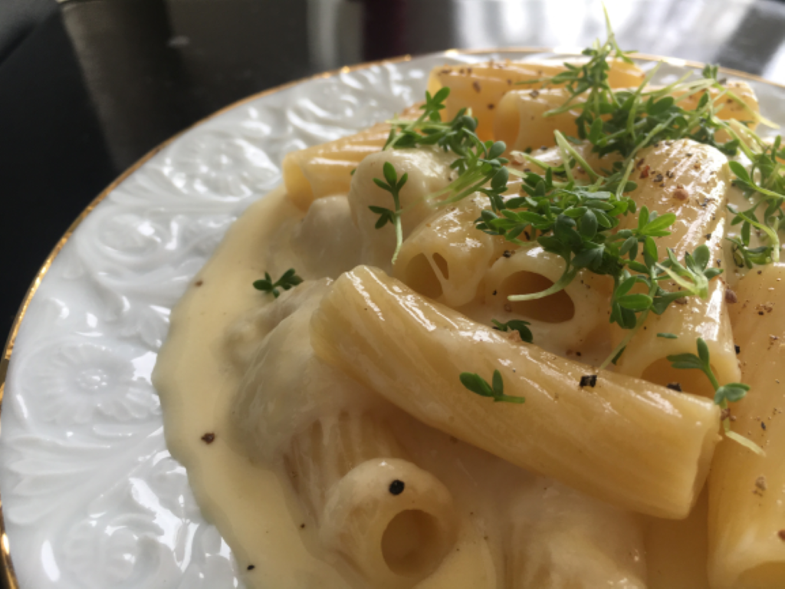
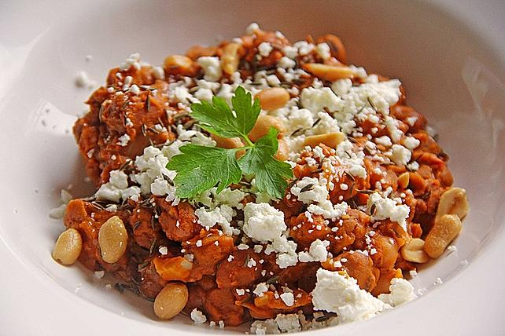

### Pasta Quattro Formaggi – Nudeln mit 4-Käse-Sauce

###### Für das Rezept habe ich mir vier Käsesorten mit sehr guter Schmelzeigenschaft ausgesucht, die ich einzeln schon sehr gerne esse, und die ganz vorzüglich miteinander harmonieren: Taleggio, Mozzarella, Emmentaler und Parmesan.

**Taleggio**
ist ein italienischer Weichkäse aus Kuhmilch, der kräftig und würzig schmeckt. Er gehört zu den sogenannten Rotschmierkäse, deutlich erkennbar an der orange-roten Käserinde. Zudem weist Taleggio grüngraue Schimmelflecken auf der Rinde auf, die charakteristisch für ihn sind. Die Rinde wird nicht mitgegessen.
**Mozzarella**
kennt ihr wahrscheinlich alle. Er zählt zu den Brühkäsen (auch Filatakäse genannt), genau wie Provolone oder Burratta. Um Mozzarella herzustellen wird Käsebruch in ca. 80 Grad heißem Wasser gebrüht und danach geknetet und gezogen, bis er weich ist und zu den uns vertrauten Kugeln geformt werden kann.

**Emmentaler**
gibt es in verschiedenen Reifegraden. Der jüngere schmeckt mild, der älteste kräftig, fast wie ein Bergkäse. Der Hartkäse stammt ursprünglich aus der Schweiz, wird heute aber von vielen Käsenationen hergestellt. Ich habe mich für deutschen entschieden, der nicht allzu kräftig im Geschmack war.
**Parmesan**
ist mit Mozzarella zusammen wahrscheinlich der bekannteste italienische Käse, vor allem in Kombination mit Pasta. Ich gönne mir ab und an einen langgereiften Parmigiano Reggiano, der einfach am besten schmeckt. Ihr könnt aber natürlich auch einen Grana Padano nehmen.

Neben der Pizza Quattro Formaggi habe ich mich für dieses Rezept noch von Käsefondue inspirieren lassen und einen Schuss trockenen Weißwein in die Käsesauce gegeben.
Während ich dies schreibe frage ich mich, ob ich beim nächsten Käsefondue auch Nudeln dazu servieren sollte. Was meint ihr?

Wichtig: Immer gut rühren! Der Käse soll sich wie bei Käsefondue richtig schön verbinden und eine cremige Masse ergeben. Trotzdem kann es passieren, dass einzelne Käsesorten wie der Mozzarella sich wieder trennen und kleine Käseklumpen bilden. Das macht aber gar nichts, ganz im Gegenteil: Beim Essen waren das die besten Stellen.
!(kässe.jpg)

https://pastamaniac.de/pasta-quattro-formaggi-nudeln-vier-kaese-sauce/

### Sudanesisches Bohnengericht

#### Zutaten:

> 1 Dose	Bohnen (Saubohnen - Fava Beans)

>1 m.-große	Zwiebel(n)

>5 EL	Öl (Erdnussöl)
>1 EL	Erdnussbutter, cremig

>1 TL	Kreuzkümmel

>1 Msp.	Chilipulver

>1 Handvoll	Schafskäse

>1 Tasse	Wasser

#### Zubereitung :

Die Bohnen aus der Dose in ein Sieb geben und gut abspülen. Die Zwiebel würfeln und im Erdnussöl im Topf anbraten. Sobald sie leicht gebräunt ist, die gepresste Knoblauchzehe dazugeben. Anschließend die klein geschnittene Tomate ebenfalls in den Topf geben und köcheln lassen, bis die Tomatenstücke weich sind.

Das Ganze mit einem Pürierstab zerkleinern und die Bohnen hinzufügen. Eine Tasse Wasser und die Gewürze dazugeben und 15 min. köcheln lassen. Einen Teil der Bohnen zerstampfen und die Erdnussbutter einrühren, bis die Bohnen angedickt sind.

Die Bohnen auf einem Teller servieren, mit Öl übergießen und mit zerdrücktem Schafskäse und Kreuzkümmel bestreuen. Dazu wird Fladenbrot gereicht, welches als "Besteck" dient.

**ANDERE REZEPT IN YOUTUBE**

